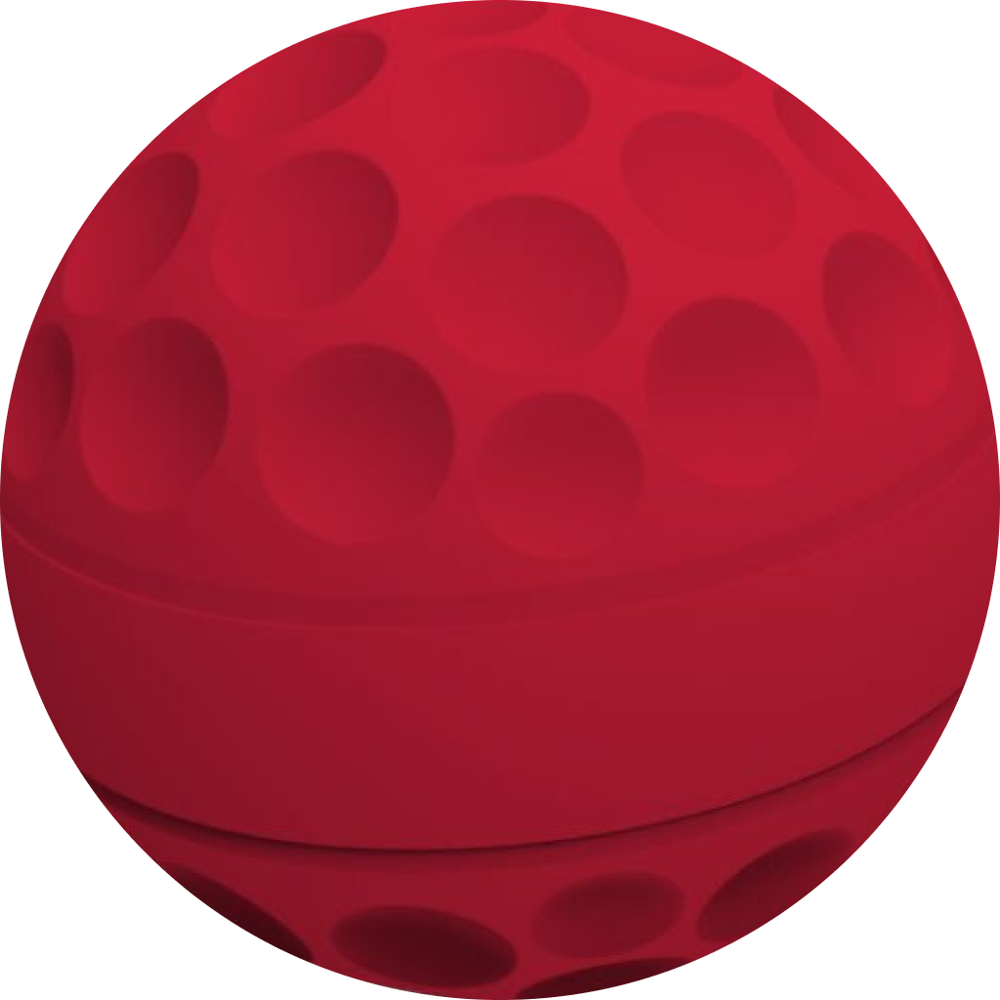

   
  

    
  

  

    
  

> ### Vexbot Public Release

> `vexbot` is now available on any discord server! For more information, and to add it to your server, go to https://vexbot.bren.app

`vexbot` is a discord bot for vex robotics discord servers.

# Commands

### META

- `/ping`
- `/help` Lists all commands and usage
- `/config` Utilites for managing the server configuration /config
  - `/config list` Shows this server's configuration
  - `/config set` Set a configuration for this server /config set server-log true
    leaderboard Lists people by their number of messages posted /leaderboard
    tally Tallies the leaderboard /tally

### ADMIN

- `/probate` or `/dq` Puts listed members on probation
- `/grant` Grants the user a role
- `/vanity` Creates a vanity role
- `/purge` Mass delete messages in a channel
- `/lock` Locks the channel
- `/unlock` Unlocks the channel
- `/disable` Disables vexbot commands in your server
- `/enable`/ Enables vexbot commands in your server

### VEX

- `/events` Lists events in a given region
- `/team` Lists team record for this season /team 3796B
- `/winrates` Calcuates winrates leaderboard for the given region
  `/qna` Utilites to manage official Q&A questions
  - `/qna ask` Links to the form to ask a Q&A
  - `/qna search` Searches the Q&A for the specified search term
  - `/qna moniter` or `/qna sub` Notifies you when the specified qna gets answered

### HELPER

- `/poll` or `/question` Simple reaction polls
- `/roll` Rolls dice using 3d6+2 format
- `/latex` or `/math` Outputs latex images from the given input

and more!

# Behaviors

- Automatic Verification System
- Message / Event Logging
- Probation
- Continous Deployment

### Documentation

If you need help setting up vexbot for your server, please refer to https://vexbot.bren.app/docs/
